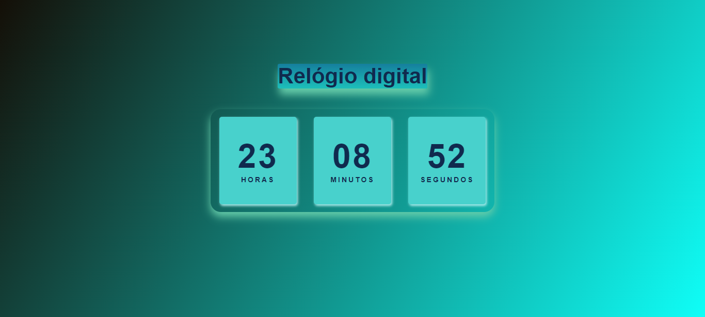

<h1 align="center">RELÓGIO DIGITAL</h1>

    Com o intuito de aprender e praticar, resolvir criar esse "Relógio digital", junto com alguns videos, ultizando as tecnolgias citadas.

  <a href="#=tecnologias">Tecnologias</a> &nbsp;&nbsp;&nbsp;|&nbsp;&nbsp;&nbsp;
  <a href="#-projeto">Projeto</a> &nbsp;&nbsp;&nbsp;|&nbsp;&nbsp;&nbsp;
  <a href="#memo-licença">Licença</a>

  

 

    
    

## 🚀 Tecnologias

Esse projeto foi desenvolvido com as seguintes tecnologias:

- HTML
- CSS
- JAVASCRIPT
- Git e GitHub

## 💻 Projeto

Esse e um Relógio digital, criado com intuito de aprender e praticar, e ter novos conhecimentos!

## :memo: Licença

Esse projeto está sob a licença MIT. Veja o arquivo [LICENSE](LICENSE.md) para mais detalhes.
